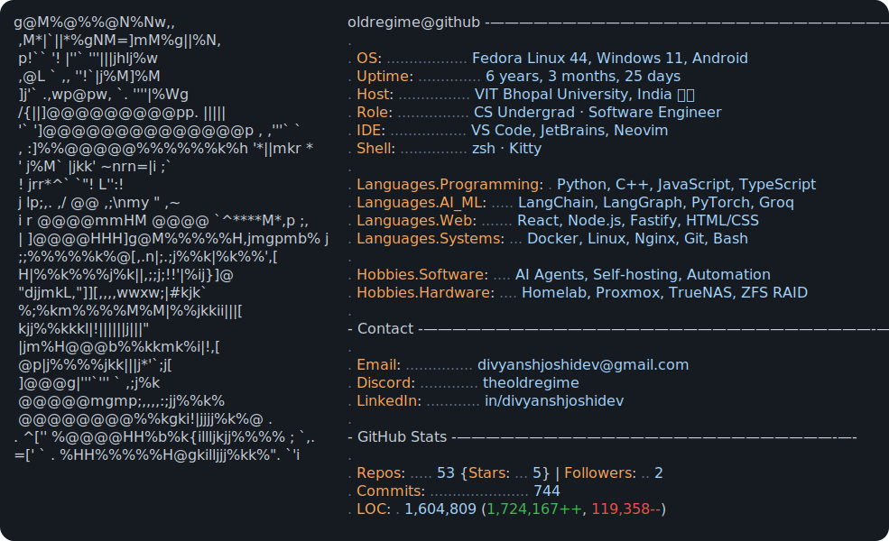
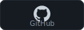
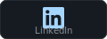
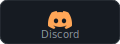
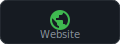
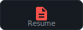

<a href="https://github.com/oldregime/oldregime">
  <picture>
    <source media="(prefers-color-scheme: dark)"  srcset="dark_mode.svg">
    <source media="(prefers-color-scheme: light)" srcset="light_mode.svg">
    
  </picture>
</a>

  <a href="https://github.com/oldregime">
    <picture>
      <source media="(prefers-color-scheme: dark)" srcset="assets/link_github_dark.svg">
      <source media="(prefers-color-scheme: light)" srcset="assets/link_github_light.svg">
      
    </picture>
  </a>
  <a href="https://linkedin.com/in/divyanshjoshidev">
    <picture>
      <source media="(prefers-color-scheme: dark)" srcset="assets/link_linkedin_dark.svg">
      <source media="(prefers-color-scheme: light)" srcset="assets/link_linkedin_light.svg">
      
    </picture>
  </a>
  <a href="https://discord.com/users/theoldregime">
    <picture>
      <source media="(prefers-color-scheme: dark)" srcset="assets/link_discord_dark.svg">
      <source media="(prefers-color-scheme: light)" srcset="assets/link_discord_light.svg">
      
    </picture>
  </a>
  <a href="https://oldregime.github.io">
    <picture>
      <source media="(prefers-color-scheme: dark)" srcset="assets/link_website_dark.svg">
      <source media="(prefers-color-scheme: light)" srcset="assets/link_website_light.svg">
      
    </picture>
  </a>
  <a href="https://oldregime.github.io/#resume">
    <picture>
      <source media="(prefers-color-scheme: dark)" srcset="assets/link_resume_dark.svg">
      <source media="(prefers-color-scheme: light)" srcset="assets/link_resume_light.svg">
      
    </picture>
  </a>
  <a href="mailto:divyanshjoshidev@gmail.com">
    <picture>
      <source media="(prefers-color-scheme: dark)" srcset="assets/link_email_dark.svg">
      <source media="(prefers-color-scheme: light)" srcset="assets/link_email_light.svg">
      
    </picture>
  </a>

