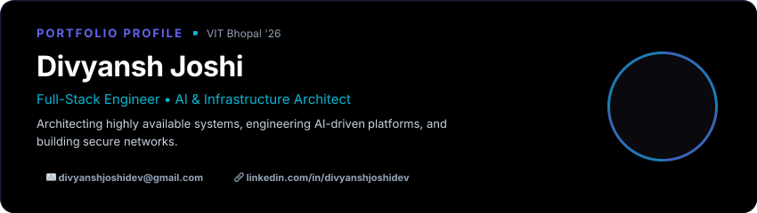
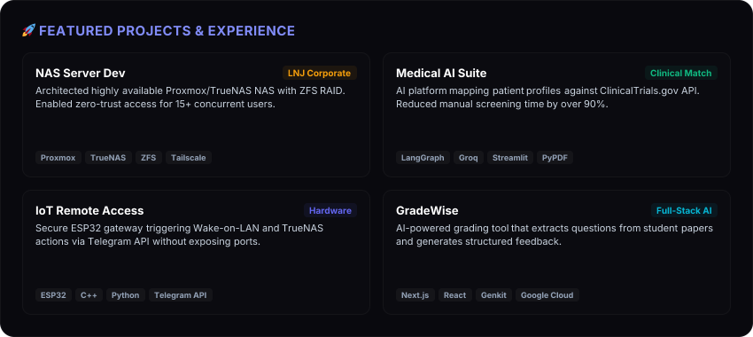
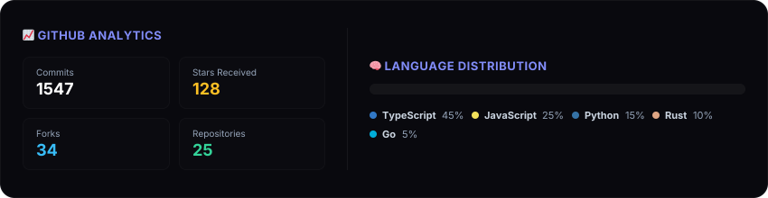

 

## ⚡ About Me

I'm a **B.Tech Computer Science student at Vellore Institute of Technology (VIT)** specializing in architecting highly available systems, engineering AI-driven platforms, and building secure networks.

Whether it's deploying **LangGraph LLM workflows**, setting up **TrueNAS on Proxmox** with ZFS RAID, or writing secure **ESP32** gateways using C++, I thrive on solving complex, low-level problems with scalable code. I love transforming unstructured data into actionable insights and automating infrastructure to achieve zero-trust networking.

 

 

 

 

  <i>"Simplicity is the ultimate sophistication."</i>  
  <a href="https://linkedin.com/in/divyanshjoshidev">Let's connect and build something awesome together! 🚀</a>

