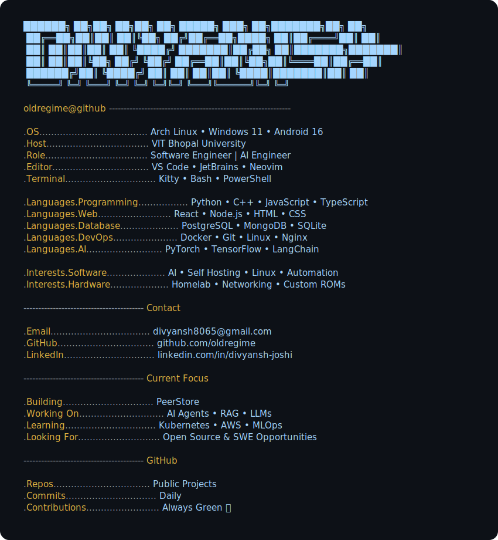

  <picture>
    <source media="(prefers-color-scheme: dark)" srcset="terminal_dark.svg">
    <source media="(prefers-color-scheme: light)" srcset="terminal_light.svg">
    
  </picture>

---

## GitHub Analytics

---

## Contribution Graph

---

## Visitor Count

---

## Quote

> *"Programs must be written for people to read, and only incidentally for machines to execute."*  
> — Harold Abelson

---

### Thanks for visiting 👋

*"Code is temporary. Skills are permanent."*

